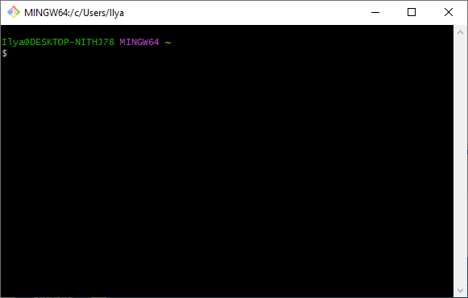
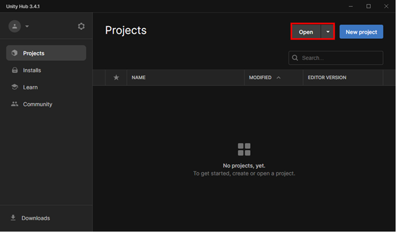
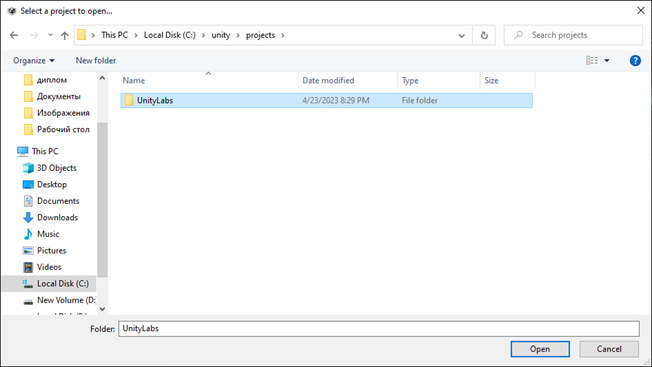
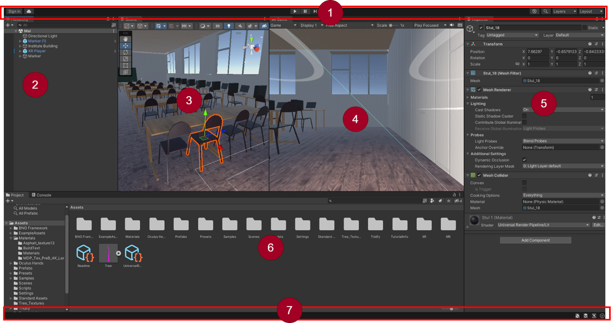
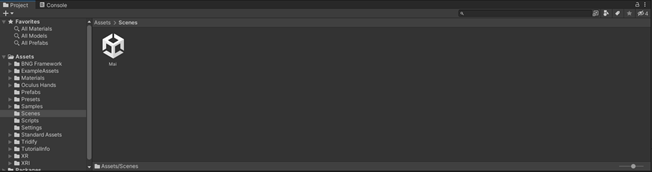
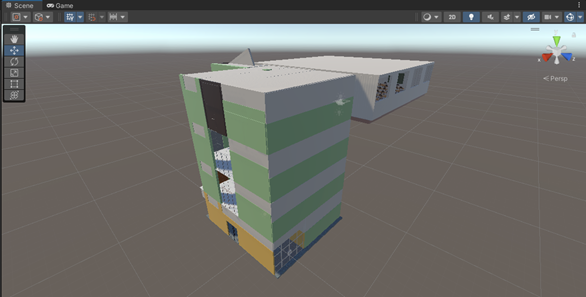
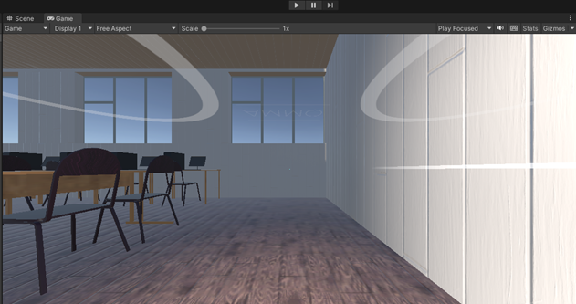

# Лабораторная работа №1 «Запуск проекта в Unity»
Цель работы: Изучение интерфейса Unity на примере запуска шаблона проекта
Задание: скачать шаблон проекта и запустить его 
## Шаг 1: Клонирование проекта из GitHub
Шаблон проекта загружен на github, для его клонирования на ваш компьютер откройте Git Bash
 


Git Bash это эмулятор среды bash для Windows, в котором можно легко выполнять нужные для нас git команды.
В начале необходимо создайте директорию, где будет хранится проект используя команду mkdir и перейдите в нее при помощи cd

```
$ mkdir -p c:/unity/projects
$ cd c:/unity/projects
```

После этого мы можем переходить к клонированию репозитория на свой компьютер.
```
$ git clone https://github.com/Roflersssd/UnityLabs.git
```
## Шаг 2: Запуск проекта в Unity
Запустите Unity Hub и перейдите во вкладку Projects
 


Нажмите кнопку Open и выберите проект, он будет расположен в C:\unity\projects\UnityLabs
 


После загрузки откроется Unity
## Шаг 3: Выбор сцены в Unity
 


1) Панель инструментов обеспечивает доступ к наиболее важным рабочим функциям. Слева он содержит 
основные инструменты для управления Сценой
 и GameObjects
 внутри него. В центре находятся элементы управления воспроизведением, паузой и шагом. Кнопки справа 
 дают вам доступ к Unity Collaborate, Unity Cloud Services и вашей учетной записи Unity, за которыми 
 следует меню видимости слоев и, наконец, меню макета редактора (которое предоставляет несколько 
 альтернативных макетов для окон редактора и позволяет вам сохранять ваши собственные макеты).
2) Окно Hierarchy представляет собой иерархическое текстовое представление каждого игрового объекта 
в сцене. У каждого элемента сцены есть запись в иерархии, поэтому два окна неразрывно связаны. 
Иерархия показывает структуру того, как игровые объекты присоединяются друг к другу.
3) Вид игры имитирует то, как будет выглядеть окончательная визуализированная игра через сцену 
Камеры
. Когда вы нажимаете кнопку «Воспроизвести», начинается моделирование.
4) представление "Сцена" позволяет визуально перемещаться по сцене и редактировать ее. Вид сцены
 может отображать трехмерную или двухмерную перспективу, в зависимости от типа Проект, над которым 
 вы работаете.
5) Окно инспектора позволяет просматривать и редактировать все свойства текущего выбранного игрового 
объекта. Поскольку разные типы игровых объектов имеют разные наборы свойств, макет и содержимое Inspector
 меняется каждый раз, когда вы выбираете другой игровой объект.
6) В окне проекта отображается ваша библиотека ресурсов, доступных для использования в вашем проекте. 
Когда вы импортируете ресурсы в свой проект, они появляются здесь.
7) Строка состояния предоставляет уведомления о различных процессах Unity и быстрый доступ к соответствующим 
инструментам и настройкам.
В нижней части экрана представлены папки, которые собой формируют проект в Unity
+	Assets: это папка, которая содержит все ресурсы, необходимые для проекта, такие как модели, текстуры, звуки, 
анимации, скрипты и т.д. Эта папка должна быть организована в подпапки для удобства поиска и управления ресурсами.
+	Scenes: Каждая сцена в Unity представляет собой отдельную игровую карту или экран, который может быть загружен 
и отображен в игре. Каждая сцена обычно содержит набор объектов, которые отображаются на экране, 
а также управляющие скрипты.
+	Scripts: это папка, которая содержит все скрипты, написанные на языке программирования C#, которые управляют 
поведением игровых объектов и других элементов игры. Эти скрипты могут быть написаны различными способами, 
включая использование системы компонентов Unity и событийной модели.
+	Prefabs: Prefabs в Unity представляют собой готовые игровые объекты или группы игровых объектов, которые могут 
быть повторно использованы в различных сценах и настройках. После создания и сохранения префаба его можно перетащить 
в сцену, как обычный игровой объект.
+	Plugins: это папка, которая содержит сторонние плагины, используемые в проекте. Unity поддерживает множество 
платформ и API, и многие сторонние плагины могут помочь в расширении функциональности проекта.
+	Packages: это папка, которая содержит пакеты Unity, которые могут быть загружены и установлены в проект. Эти 
пакеты могут содержать новые функции, улучшения производительности и другие компоненты, которые могут быть 
использованы для улучшения проекта.
Откроем сцену. Для этого нужно перейти в папку Secnes и дважды нажать на сцену Mai 
 

После этого локация начнет отображаться в окне Secne
 

Для передвижения камеры по локации используйте клавиатуру и мышь:
+	Щелкните правой кнопкой мыши на сцене и удерживайте ее для перемещения камеры по сцене.
+	Для приближения или отдаления камеры используйте колесико мыши.
+	Используйте клавиши W, A, S и D на клавиатуре для перемещения камеры вперед, влево, назад и вправо соответственно.
+	Чтобы повернуть камеру, удерживайте правую кнопку мыши и перемещайте мышь в нужном направлении.
+	Чтобы повернуть камеру по вертикали, удерживайте клавишу Alt и перемещайте правую кнопку мыши вверх или вниз.
+	Чтобы перемещаться по сцене быстрее, удерживайте клавишу Shift.
+	Для установки точки обзора на определенный объект на сцене, нажмите клавишу F, когда камера направлена на этот объект.
+	Чтобы вернуться к начальному положению камеры, нажмите клавишу Home.


## Шаг 4: Запуск проекта в Unity
Для запуска проекта нажмите кнопку Play
 


Для управления передвижением персонажа можно использовать клавиатуру и мышку или VR шлем и контролеры
Управление при помощи клавиатуры:	
+	Для перемещения – клавиши W, A, S, D
+	Для поворота камеры – перемещение положения мыши
+	Для управления сгибанием пальцев – клавиши Z, X, C, V, B, N
