# Лабораторная работа №2 «Создание игрового объекта и настройка его компонент»
Цель работы: изучить методы создания и способы работы с компонентами игровых объектов в Unity
Задание: пользуясь инструкцией, создать у игрового объекта «маркер» и добавить ему компоненты
## Шаг 1: Создание объекта «Маркер»
Для начала рассмотрим маркер и мысленно разделим его на простые объемные геометрические тела:
 
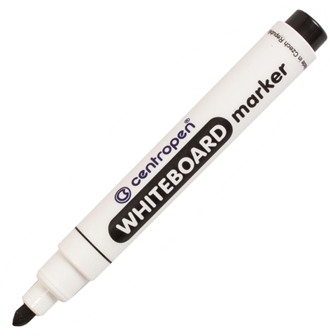

Данный маркер состоит из четырех цилиндров разного размера и одной сферы.
В Unity можно легко добавлять и группировать простые фигур для создания более сложных объектов
С помощью клавиш управления, переместитесь в аудиторию на 4ом этаже, здесь на столе мы будем создавать «Маркер»
Для перемещения используйте инструменты tools 
 
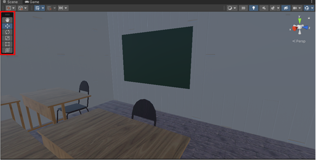

1) Move   Нажмите и перетащите, чтобы переместить камеру.
2) Orbit   Удерживая клавишу Alt , щелкните левой кнопкой мыши и перетащите камеру, чтобы она вращалась вокруг текущей точки поворота.
3) Этот параметр недоступен в 2D-режиме, поскольку вид является ортогональным.
4) Zoom   Удерживая нажатой клавишу Alt, щелкните правой кнопкой мыши и перетащите, чтобы увеличить представление сцены.

Для управления размером и положением объектов можно использовать мышь или введите значения непосредственно в числовые поля компонента Transform в Inspector.

Кроме того, вы можете выбрать каждый из четырех режимов преобразования с помощью горячей клавиши: W для перемещения, E для поворота, R для масштабирования, T для RectTransform и Y для преобразования.
 
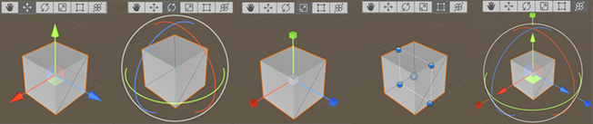

1. Создадим пустой объект для того, чтобы в него группировать все фигуры, из которых будет состоять «Маркер». Для этого нажмите правой кнопкой мыши в окне Hierarchy и выберете Create Empty, после чего переименуйте новый объект в Marker
2. Добавьте 4 цилиндр (Cylinder) и 1 капсулу (Capsule), выбрав «3D Object» → «Cylinder» и поместите его под пустой объект Marker
 
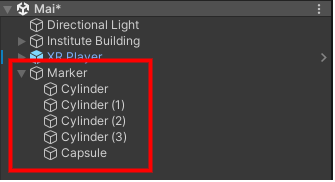

3. Для каждого объекта настройте положение, поворот и размер, изменив поля Transform в Inspector на значения представленные в таблице:

| Имя объекта  | Position     | Rotation Scale                 |
|--------------|--------------|--------------------------------|
| Cylinder     | 0, -0.038, 0 | 0, 0, 0 | 0.02, 0.05, 0.02     |
| Cylinder (1) | 0, -0.097, 0 | 0, 0, 0 | 0.02, 0.0086, 0.02   |
| Cylinder (2) | 0, 0.0098, 0 | 0, 0, 0 | 0.0146, 0.01, 0.02   |
| Cylinder (3) | 0, 0.022, 0  | 0, 0, 0 | 0.0098, 0.006, 0.009 |
| Capsule      | 0, 0.316, 0  | 0, 0, 0 | 0.007, 0.006, 0.0093 |

Добавим точку для захвата (Grab Point):
Для этого внутри объекта Marker создайте точку (Create Empty), переименуйте в «Grab Point» и установите следующие значения
 
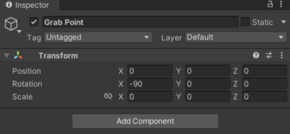

В результате у вас должен получиться маркер
 
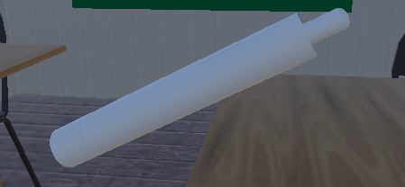

## Шаг 2: Работа с компонентами объекта «Маркер»
Компоненты (Components) в Unity - это модули, которые прикрепляются к игровым объектам и определяют их функциональность и поведение. Компоненты являются основным способом настройки и программирования поведения объектов в Unity.
Каждый игровой объект в Unity может иметь один или несколько компонентов, которые могут быть добавлены, удалены и настроены через редактор Unity. Компоненты могут быть созданы как стандартные компоненты, которые поставляются с Unity, так и пользовательские компоненты, которые вы можете написать самостоятельно с помощью языка программирования C# или JavaScript.
Некоторые из наиболее распространенных компонентов в Unity:
1) Transform: компонент, который определяет позицию, поворот и масштаб объекта в пространстве.
2) Renderer: компонент, который отвечает за отображение графики объекта на экране и позволяет настраивать его материал, цвет и другие параметры.
3) Collider: компонент, который позволяет объекту взаимодействовать с другими объектами в сцене, например, считать столкновения и триггеры.
4) Rigidbody: компонент, который добавляет физические свойства объекта, такие как масса, гравитация, скорость и т.д.
5) Animator: компонент, используемый для создания анимаций объектов в игре.
6) Audio Source: компонент, который отвечает за воспроизведение звуковых эффектов объекта.
7) Script: компонент, который позволяет вам добавлять скрипты в объект, чтобы изменять его поведение и функциональность.
8) Particle System: компонент, используемый для создания различных визуальных эффектов, таких как дым, огонь, дождь и т.д.
Использование компонентов в Unity дает вам гибкость и контроль над поведением и функциональностью игровых объектов, что позволяет создавать более сложные и интересные игровые механики.
Чтобы добавить компонент к игровому объекту, нужно в окне «Inspector» прокрутить список компонент в самый низ, нажать кнопу «Add Components» и выбрать нужный вам компонент
 
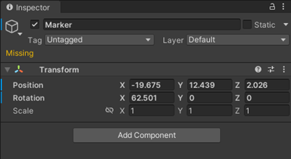

Раскрасим объект «Маркер»:
1) В панели проекта выберете папку «Materials»
2) Нажмите правой кнопкой мыши на пустой области в папке и выберите пункт «Create» → «Material»
3) Введите имя для нового материала и нажмите Enter, чтобы создать материал
4) В окне «Inspector» выберете цвет
 
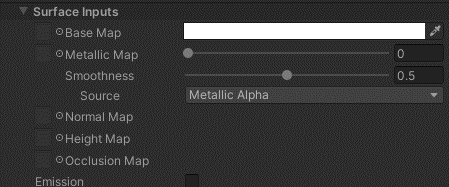

5) Перейдите в компоненты составной части маркера и перетащите созданный материал в поле «Mesh Renderer» → «Materials»
 
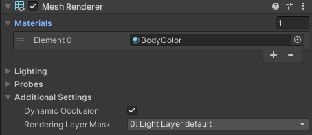

6) Повторите предыдущие пункты для каждого элемента «Маркер» 

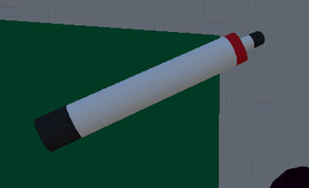

Добавим физические поведение нашему объекту:
1) Выберете целиком объект «Маркер»
2) Добавите компоненту «Rigidbody»
 
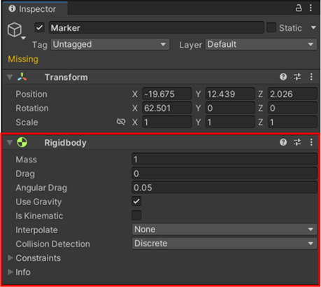

Теперь при запуске проекта, если «Маркер» находится в воздухе, то он начнет падать на другую поверхность
