# Инструкция по установке и запуску Unity:
## Шаг 1: 
Скачайте Unity с официального сайта (https://unity.com/).На главной странице 
кликните на кнопку "Download Unity Hub". 
Или запустите файл с установочной флэшки UnityHubSetup.exe  

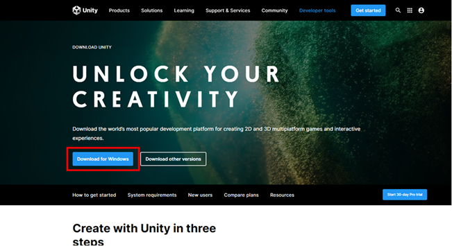

## Шаг 2: 
Установите Unity Hub, следуя инструкциям.
 
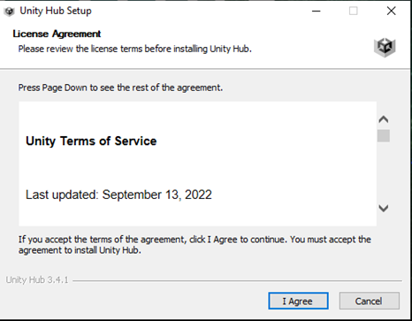

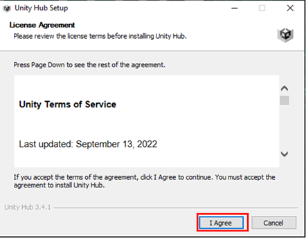
 
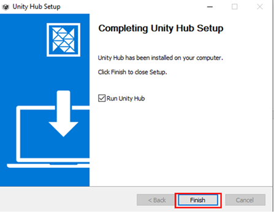

## Шаг 3: 
Откройте Unity Hub и авторизуйтесь в своей учетной записи Unity. 
Если у вас еще нет учетной записи, создайте ее и авторизуйтесь
 
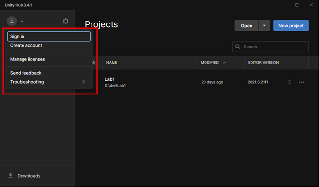

## Шаг 4: 
В разделе "Installs" нажмите на кнопку "Install Editor".  

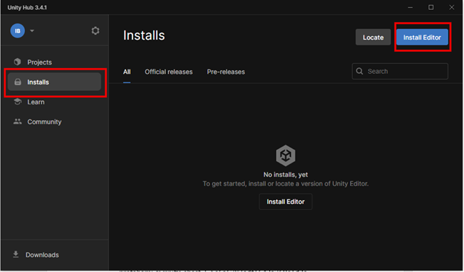

## Шаг 5:
Выберите последнюю версию Unity c пометкой LTS и компоненты для установки, затем нажмите на кнопку "Next". 
 
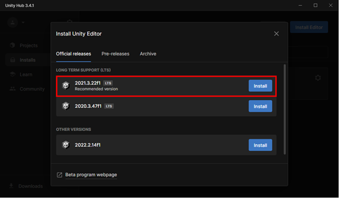

## Шаг 6: 
Выберете модуль для Microsoft Visual Studio
 
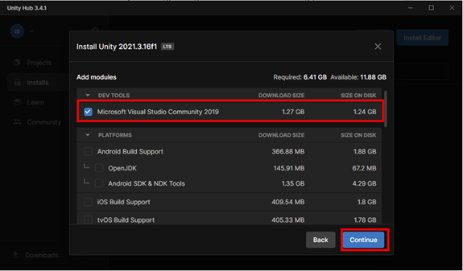
 
#Запуск:
## Шаг 1: 
Откройте Unity Hub и выберите раздел "Projects"
 
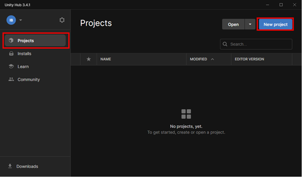

## Шаг 2: 
Нажмите на кнопку "New project" и шаблон для VR приложений
 
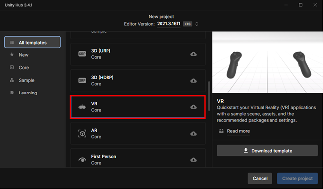

## Шаг 3:
Укажите имя проекта и нажмите кнопку “Create project”
 
[Рисунок 11 – Вкладка выбора имени проекта](setup_imgs/Picture11.png)

## Шаг 4:
Выберите нужную версию Unity для запуска проекта и нажмите на кнопку "Open" 

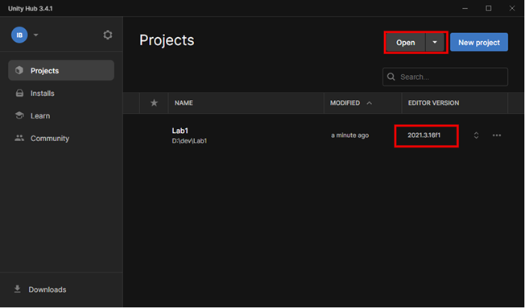

## Шаг 5:
Дождитесь загрузки Unity проекта
 
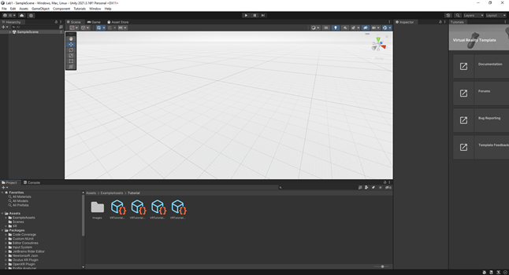
