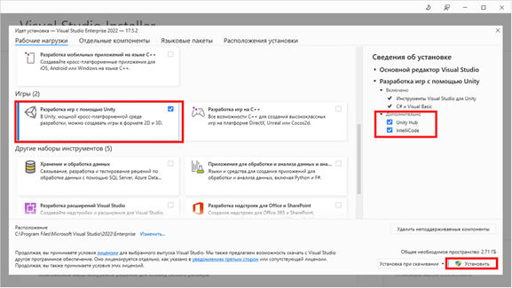

# Инструкция по установке и запуску Unity:
## Шаг 1: 
Скачайте Unity с официального сайта (https://unity.com/).На главной странице 
кликните на кнопку "Download Unity Hub". 
Или запустите файл с установочной флэшки UnityHubSetup.exe  

## Шаг 2: 
Установите Unity Hub, следуя инструкциям.
 

 

## Шаг 3: 
Откройте Unity Hub и авторизуйтесь в своей учетной записи Unity. 
Если у вас еще нет учетной записи, создайте ее и авторизуйтесь
 

## Шаг 4: 
В разделе "Installs" нажмите на кнопку "Install Editor".  

## Шаг 5:
Выберите последнюю версию Unity c пометкой LTS и компоненты для установки, затем нажмите на кнопку "Next". 
 

## Шаг 6: 
Выберете модуль для Microsoft Visual Studio
 

 
#Запуск:
## Шаг 1: 
Откройте Unity Hub и выберите раздел "Projects"
 

## Шаг 2: 
Нажмите на кнопку "New project" и шаблон для VR приложений
 

## Шаг 3:
Укажите имя проекта и нажмите кнопку “Create project”
 
[Рисунок 11 – Вкладка выбора имени проекта](setup_imgs/Picture11.png)

## Шаг 4:
Выберите нужную версию Unity для запуска проекта и нажмите на кнопку "Open" 

## Шаг 5:
Дождитесь загрузки Unity проекта
 

# Настройка среды разработки
## Шаг 1:
Установите [Visual Studio installer](https://visualstudio.microsoft.com/ru/) или запустите файл VisualStudioSetup.exe с установочной флэшки
 

## Шаг 2:
Выберите Установить или Изменить уже установленную Visual Studio 
 

## Шаг 3:
Во вкладке Рабочие нагрузки выберите опцию Разработка игр с помощью Unity
 

## Шаг 4:
Если Unity уже установлено выберите Unity Hub дополнительной опцией
## Шаг 5:
Нажмите кнопку Установить или Изменить для выполнения установки 
 

# Установка Visual Studio и Unity.
После завершения установки Visual Studio можно приступать к установке Unity. Для этого: 
## Шаг 1:
Откройте Unity Hub 
## Шаг 2:
В окне Unity Hub на левой стороне выберите вкладку "Install".
 

## Шаг 3:
Нажмите на кнопку настроек и во всплывающем овне выберете опцию "Add modules". 
 

## Шаг 4:
В окне "Добавить версию Unity" выберите версию Unity, которую хотите установить. 
## Шаг 5:
Нажмите "Далее", чтобы начать установку. 
 

## Шаг 6:
На шаге "Добавление модулей к установке" выберите "Install".
 

# Инструкция по установке Git для Windows
Переходим на официальный сайт и выбираем установщик, который подходит под вашу 
систему `https://git-scm.com/download/win` или запустите файл Git-2.40.1-64-bit с установочной флэшки.
 

 

# Подключение оборудования
Для подключения Oculus Quest к компьютеру вам понадобятся следующие компоненты: 
1. Oculus Quest 
2. Кабель USB-C - USB-A (3.0 или новее) 
3. Компьютер с операционной системой Windows
 Подключение Oculus Quest: 
1. Подключите кабель USB-C - USB-A к Oculus Quest и компьютеру. 
2. На Oculus Quest перейдите на экран настроек, выберите «Настройки», затем «Режим разработчика» и включите режим разработчика.
3. На компьютере загрузите программное обеспечение Oculus (если у вас его еще нет), перейдя [на сайт](https://www.oculus.com/setup/) и следуйте инструкциям на экране для установки. 
4. Как только установка завершена, запустите Oculus на компьютере и введите свой логин и пароль Oculus. 
5. Подключите Oculus Quest к компьютеру с помощью кабеля USB-C - USB-A, а затем наденьте наушники Oculus Quest. 
6. На компьютере откройте раздел «Устройства» и выберите «Добавить устройство». Выберите Oculus Quest из списка доступных устройств, чтобы завершить настройку. 
7. После завершения настройки Oculus Quest будет готов к использованию с играми и приложениями, которые поддерживают виртуальную реальность в Oculus Store.
